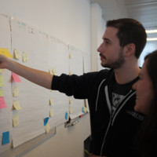

> _[Raw version](https://github.com/nicolas-gautron/nicolas-gautron.github.io "Raw version on Github")_ | _[Online version](https://nicolas-gautron.github.io/ "Online version")_ | :us: _[English PDF](NicolasGautronCV_EN.pdf "Nicolas Gautron - English resume")_ | :fr: _[French PDF](NicolasGautronCV_FR.pdf "Nicolas Gautron - French resume")_

# Nicolas Gautron - Freelance web developer

:email: [nicolas.gautron@ohhappy.dev](mailto:nicolas.gautron@ohhappy.dev "Send me an email")

:birthday: Born in 1989

:earth_africa: From Paris in France

 [nicolasgautron](https://www.linkedin.com/in/nicolasgautron "Nicolas Gautron on Linkedin")

 [ohhappydev](https://www.malt.fr/profile/ohhappydev "Nicolas Gautron on Malt")

 [nicolas-gautron](https://github.com/nicolas-gautron "Nicolas Gautron on Github")

\
&nbsp;

## Who am I?

&nbsp;

✔ 10 years of experience in PHP.

✔ Open to all technologies.

&nbsp;

Followed by a professional coach during two years, I had the chance to experience several psychological tools and models. While the Process Communication represents the way we all communicate with each other, in my case, I find the result really representative of my whole personality:
##### Base: thinker at 100%

I like to organize things, to test new processes or methodologies, to fail, to test again and to adapt to new situations. I'm quite direct in my communication and while I'm able to assume the political part of my job, I avoid it as much as I can.

##### Empathetic / harmoniser at 100%

As a former team leader and manager, there is no ritual more important for me than the ones allowing the feedback and the global communication: retrospective, one-to-one, mood of the week, team health check. I liked to involve my team in the decisions, basing some meetings on formats inspired by the holacracy world and encouraging everyone to speak freely. I trusted my team members and their professionalism, giving them the leadership on their subjects, making them autonomous as much as possible, allowing them to communicate with partners and to deploy some features in production without my approval.

##### Current phase: dreamer / imaginer at 85%

If someone asked me the part of my job I prefer, I would definitely answer: the architectural conception of a subject. I love Identifying and understanding both the business and technical concepts and their responsibilities. In my job, I value the continuous apprenticeship of the business as much as the technical aspects. Creating an ubiquitous language and understanding the separation and the links between the concerns is for me a key success factor for the long term maintainability and testability of a platform. I often need some quiet time to think and to conceptualize this kind of things on my own before bringing the subject to the team.

Feel free to contact me for more information.

Have a nice day 😊. 

\
&nbsp;

## Experience
&nbsp;

###  Oh Happy Dev &ndash; Freelance web developer
_July 2021 &ndash; Present_

[https://ohhappy.dev](https://ohhappy.dev "Nicolas Gautron - freelance web developer")

Contact me if you need any help in your technical team : development, consulting, architecture, management...

\
&nbsp;

###  Deezer &ndash; Back-end developer - architect
_August 2020 &ndash; June 2021_ 

Payment team

##### Missions
In my previous position as a lead developer, I was mainly focused on the day-to-day delivery: short-term projects, daily bug and incident management.

Now as an architect, instead of being responsible for the team implementing the functionalities, my job is centralized around the conception and the implementation of both technical and business-oriented long-term projects.

##### Example of subjects

* New logging and monitoring strategy with the ELK / Elastic Stack.

* Event based communication through Kafka.

\
&nbsp;

###  Deezer &ndash; Lead Payment Engineer
_July 2018 &ndash; August 2020_ 

Payment team

##### Missions
* Manage the development team, between 5 and 7 developers.

* Ensure team well-being with regular one-to-one, performance reviews and ritual set-ups inspired by the Agile and the Holacracy worlds.

* Build the team with the hiring and the onboarding of 5 new team members.

* Guide technical conception, keeping an eye and giving advice on the delivery but making the developers independent on their subjects.

* Code around 10% of my time, because actually: I love it.

\
&nbsp;

###  Deezer &ndash; Web developer
 
_August 2014 &ndash; July 2018_

Payment team

##### Missions

* Management of offers and recurring subscriptions.

* Rework of B2C payment journeys.

* Deployment of new global and local payment methods in an international context.

##### Main technologies

* PHP 7 using a homemade framework with a progressive migration to Symfony 4.

* jQuery.

* PHPUnit and Behat for the tests.

* Jira for the project management.

* Github for the code review.

\
&nbsp;

###  Rue du Commerce &ndash; PHP developer

_September 2012 &ndash; August 2014_

Payment team

##### Missions

* Deployment of new payment methods: consumer credit, payment in installments.

* Integration of external fraud risk management systems.

##### Main technologies

* PHP 5, homemade framework.

* MariaDb and Microsoft SQL Server, wide use of stored procedures.

* Jira for the project management.

* GitFlow for the development workflow.

\
&nbsp;

###  Orange &ndash; PHP and JavaScript developer
_September 2009 &ndash; September 2012_

_Apprenticeship_

xDSL/FTTH services maintenance team

##### Missions

* Development of internal tools ensuring the quality of service for the network equipments DSLAM and OLT.

* Server administration.

* User support.

##### Main technologies

* PHP 5 with the Zend Framework and Doctrine.

* ExtJS and jQuery.

* Oracle and MySQL databases.    

\
&nbsp;

###  Mon Epargne Online &ndash; PHP developer
_April 2009 &ndash; August 2009_

_Internship_

##### Missions

Development of iOS 3 applications and web pages specialized on finance and ecology.

##### Main technologies

* PHP 4

* Objective-C    

\
&nbsp;

## Education

&nbsp;

###  Executive MBA Epitech &ndash; IT management and entrepreneurship
_2018 &ndash; 2019_  

✔ Management

✔ Finance

✔ Marketing

✔ Communication

✔ Human resources

✔ Entrepreneurship

✔ Agile - Project management

\
&nbsp;

###  Epita &ndash; IT engineer
_2009 &ndash; 2012_

3 years of apprenticeship with Orange

\
&nbsp;

###  IUT Cachan &ndash; Electronic and industrial IT 
_2007 &ndash; 2009_

\
&nbsp;

## Side projects

&nbsp;

###  - launched in 2020

[https://tuto4.dev](https://tuto4.dev "Tutorials for web developers")

Easy and short tutorials for developers on a lot of subjects like
 docker, PHP, nodejs, web marketing and many other developer skills.
 
##### Front part

* VueJS with the use of NuxtJS. The final result is generated as static HTML
files for the production and served by Nginx.

* TypeScript.

* SCSS.

##### API part

In development mode, the front calls an API for asynchronously 
retrieving the data.

* GraphQL API running on nodejs.

* TypeScript.

##### Web marketing

* Open Graph

* Microdata

* Server-side rendering and generation of static files.

\
&nbsp;

###  - launched in 2009

[http://www.informatix.fr](http://www.informatix.fr "Tutorials for web developers in french")

It's the french version of tuto4.dev.

During my apprenticeship with Orange, the team gave me the time to learn
the Zend Framework and to build my own side project as a Proof Of Concept
of a real internal project.

* PHP 7 with the Zend Framework.
 
* Doctrine.

* Bootstrap Twitter.

* Less CSS.